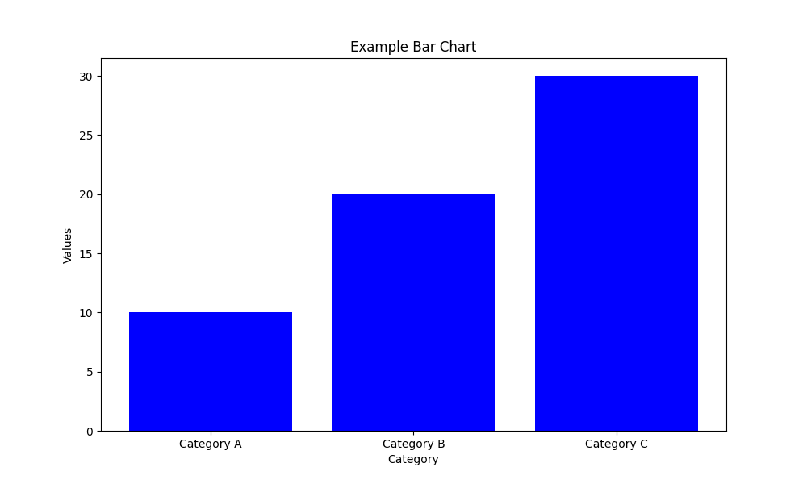
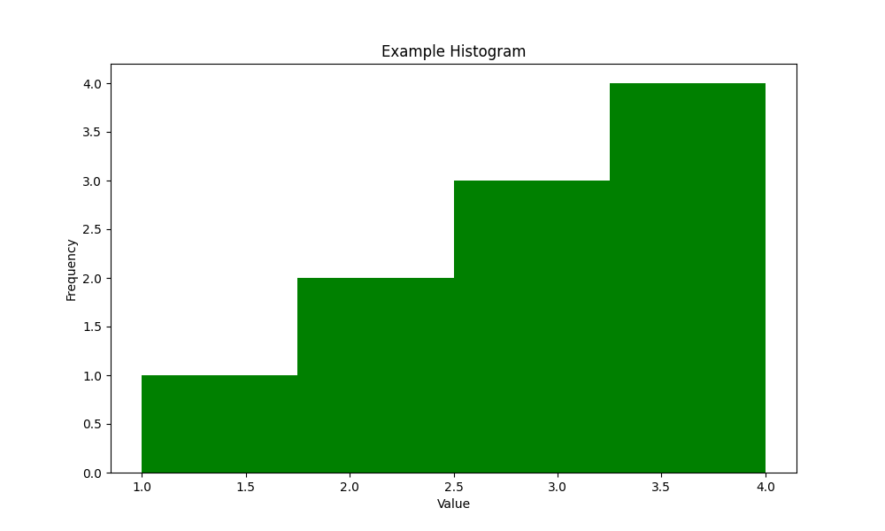
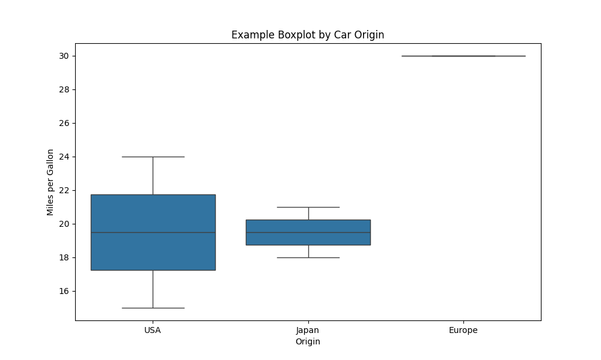
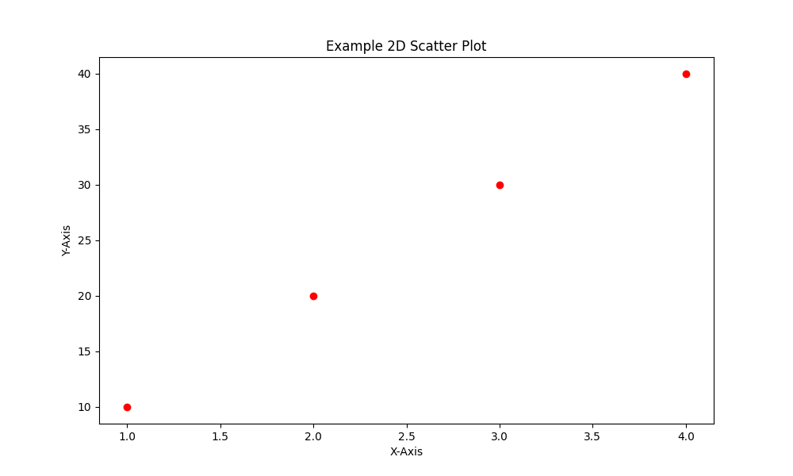

# Statistical Methods for Data Science (statsToolkit)
The project is sponsored by **Malmö Universitet** developed by Eng. Marco Schivo and Eng. Alberto Biscalchin under the supervision of Associete Professor Yuanji Cheng and is released under the **MIT License**. It is open source and available for anyone to use and contribute to.

Code course: MA660E

---

# Descriptive Statistics

This module contains basic descriptive statistics functions that allow users to perform statistical analysis on numerical datasets. The functions are designed for flexibility and ease of use, and they provide essential statistical metrics such as mean, median, range, variance, standard deviation, and quantiles.

## Functions Overview

### 1. `mean(X)`
Calculates the arithmetic mean (average) of a list of numbers.

#### Example Usage:
```python
from statstoolkit.descriptive_statistics import mean

data = [1, 2, 3, 4, 5]
print(mean(data))  # Output: 3.0
```

### 2. `median(X)`
Calculates the median of a list of numbers. The median is the middle value that separates the higher half from the lower half of the dataset.

#### Example Usage:
```python
from statstoolkit.descriptive_statistics import median

data = [1, 2, 3, 4, 5]
print(median(data))  # Output: 3
```

### 3. `range_(X)`
Calculates the range, which is the difference between the maximum and minimum values in the dataset.

#### Example Usage:
```python
from statstoolkit.descriptive_statistics import range_

data = [1, 2, 3, 4, 5]
print(range_(data))  # Output: 4
```

### 4. `var(X, ddof=0)`
Calculates the variance of the dataset. Variance measures the spread of the data from the mean. You can calculate both population variance (`ddof=0`) or sample variance (`ddof=1`).

#### Example Usage:
```python
from statstoolkit.descriptive_statistics import var

data = [1, 2, 3, 4, 5]
print(var(data))  # Output: 2.0  (Population variance)
print(var(data, ddof=1))  # Output: 2.5  (Sample variance)
```

### 5. `std(X, ddof=0)`
Calculates the standard deviation, which is the square root of the variance. It indicates how much the data varies from the mean.

#### Example Usage:
```python
from statstoolkit.descriptive_statistics import std

data = [1, 2, 3, 4, 5]
print(std(data))  # Output: 1.4142135623730951  (Population standard deviation)
print(std(data, ddof=1))  # Output: 1.5811388300841898  (Sample standard deviation)
```

### 6. `quantile(X, Q)`
Calculates the quantile, which is the value below which a given percentage of the data falls. For example, the 0.25 quantile is the first quartile (25th percentile).

#### Example Usage:
```python
from statstoolkit.descriptive_statistics import quantile

data = [1, 2, 3, 4, 5]
print(quantile(data, 0.25))  # Output: 2.0 (25th percentile)
print(quantile(data, 0.5))   # Output: 3.0 (Median)
print(quantile(data, 0.75))  # Output: 4.0 (75th percentile)
```

---

# Visualization Functions

This module contains several flexible visualization functions built using **Matplotlib** and **Seaborn**, allowing users to generate commonly used plots such as bar charts, pie charts, histograms, boxplots, and scatter plots. The visualizations are designed for customization, giving the user control over various parameters such as color, labels, figure size, and more.

## Functions Overview

### 1. `bar_chart(x, y, title=None, xlabel=None, ylabel=None, color=None, figsize=(10, 6), **kwargs)`
Creates a bar chart with customizable x-axis labels, y-axis values, title, colors, and more.

#### Example Usage:
```python
from statstoolkit.visualization import bar_chart

categories = ['Category A', 'Category B', 'Category C']
values = [10, 20, 30]

bar_chart(categories, values, title="Example Bar Chart", xlabel="Category", ylabel="Values", color="blue")
```


---

### 2. `pie_chart(sizes, labels=None, title=None, colors=None, explode=None, autopct='%1.1f%%', shadow=False, startangle=90, **kwargs)`
Creates a pie chart with options for custom labels, colors, explode effect, and more.

#### Example Usage:
```python
from statstoolkit.visualization import pie_chart

sizes = [15, 30, 45, 10]
labels = ['Category A', 'Category B', 'Category C', 'Category D']

pie_chart(sizes, labels=labels, title="Example Pie Chart", autopct='%1.1f%%', shadow=True)
```


---

### 3. `histogram(x, bins=10, title=None, xlabel=None, ylabel=None, color=None, figsize=(10, 6), **kwargs)`
Creates a histogram for visualizing the frequency distribution of data. The number of bins or bin edges can be adjusted.

#### Example Usage:
```python
from statstoolkit.visualization import histogram

data = [1, 2, 2, 3, 3, 3, 4, 4, 4, 4]

histogram(data, bins=4, title="Example Histogram", xlabel="Value", ylabel="Frequency", color="green")
```


---

### 4. `boxplot(MPG, origin=None, title=None, xlabel=None, ylabel=None, color=None, figsize=(10, 6), **kwargs)`
Creates a boxplot for visualizing the distribution of a dataset. It supports optional grouping variables, such as plotting the distribution of MPG (miles per gallon) by car origin.

#### Example Usage:
```python
from statstoolkit.visualization import boxplot

MPG = [15, 18, 21, 24, 30]
origin = ['USA', 'Japan', 'Japan', 'USA', 'Europe']

boxplot(MPG, origin=origin, title="Example Boxplot by Car Origin", xlabel="Origin", ylabel="Miles per Gallon")
```


---

### 5. `scatterplot(x, y, z=None, symbol='o', title=None, xlabel=None, ylabel=None, color=None, figsize=(10, 6), **kwargs)`
Creates a scatter plot, optionally supporting 3D-like plots where a third variable `z` can be mapped to point sizes or colors. Marker symbols and other plot properties can be customized.

#### Example Usage (2D Scatter Plot):
```python
from statstoolkit.visualization import scatterplot

x = [1, 2, 3, 4]
y = [10, 20, 30, 40]

scatterplot(x, y, title="Example 2D Scatter Plot", xlabel="X-Axis", ylabel="Y-Axis", color="red")
```


#### Example Usage (3D-like Scatter Plot):
```python
from statstoolkit.visualization import scatterplot

x = [1, 2, 3, 4]
y = [10, 20, 30, 40]
z = [50, 100, 200, 300]

scatterplot(x, y, z=z, symbol="*", title="Example 3D-like Scatter Plot", xlabel="X-Axis", ylabel="Y-Axis", color="blue")
```


---

## Example Graphics

All of the above code snippets will generate charts that you can customize further. Example output images for each function are provided in the **`examples/`** directory of the project:

- Bar Chart: `examples/bar_chart.png`
- Pie Chart: `examples/pie_chart.png`
- Histogram: `examples/histogram.png`
- Boxplot: `examples/boxplot.png`
- 2D Scatter Plot: `examples/scatterplot_2d.png`
- 3D-like Scatter Plot: `examples/scatterplot_3d.png`

These example images demonstrate what each plot looks like with the given sample data. Feel free to modify the input values, colors, labels, and other parameters to create the visuals that best fit your needs.

---

## License

This project is licensed under the MIT License - see the [LICENSE](LICENSE) file for details.

---
